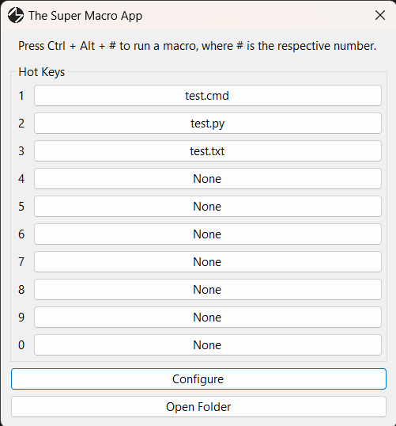
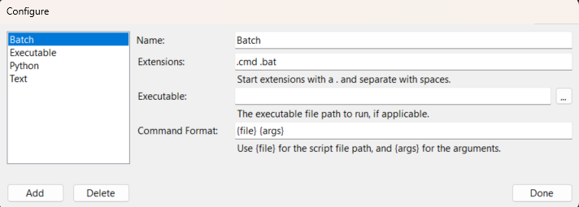
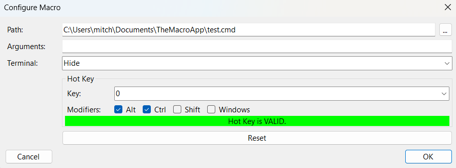

# The Super Macro App
A Windows application, meant to be able to create custom macros at the touch of a hot key.

## Installing
For the moment, installing is rather hands on. An installer will come in the future. For now, follow these steps:

* Navigate to the releases page on this Github repository.
* Download the most recent release.
* Unzip any files, if necessary.
* Run the program.
* The program will be running in the background by default. Open the app in the system tray, or click Ctrl + Alt + M to open the app.

If you wish to have the program always start when you turn on your computer, please run the program, open it from the system tray (or press Ctrl + Alt + M), open the settings window and click the checkbox to add it to the startup apps. Finally, press done.

## Usage

### Guide
The Super Macro App lives in the System Tray. It can be accessed at any time by going to the system tray and clicking on it. It can also be forcibly closed by right clicking on it there, and hitting "Exit". It can also be accessed via the keyboard hot key: Ctrl + Alt + M.

Each macro must be associated with a script of some sort. The user can customize how each script is ran by clicking the Configure button. After doing so, a new script type can be added by pressing add. After doing so, information can be filled out for the type of script. Here is an example of the window in use:

To set the script for a macro, left click on the button to the right of the corresponding number key number you would like to set. Doing so will open a window, allowing you to edit the macro data. You can set the path to the file the macro will perform on, and any command line arguments you would like to provide. You can also decide if you want the terminal to stay hidden, or to show for this specific macro. Lastly, select the hot key combination for this macro.

**REQUIREMENTS FOR MACRO HOT KEYS:**
1. The hot key must have a key selected.
2. The hot key must have at least one modifier.
3. The hot key must be in use by another macro, or another process/application on your device.

Fulfilling all of these requirements will show the macro as VALID. If any of the requirements are omitted, INVALID will be shown, and the macro will not work.

Here is an example of a macro being edited:

After the macros have been set, press the Hot Key combination of keys of the macro you would like to run. After doing so, the script will run, according to your specifications. If Terminal is set to Show, then the terminal will pop up while the script is being ran. Otherwise, it will never be seen.

### Hot Keys
| Combination | Action |
| --- | --- |
| Ctrl + Alt + M | Shows the Super Macro App. |

## Examples
The following contains some examples for script configurations and macros.
### Script Configurations
| Name | Extensions | Executable | Command Format |
| --- | --- | --- | --- |
| Audio | `.mp3 .wav` | explorer.exe | {file} |
| Batch | `.bat .cmd` | | {file} {args} |
| Executable | `.exe` | | {file} {args} |
| Image | `.png .jpeg .jpg. gif` | explorer.exe | {file} |
| Python | `.py` | C:\Users\user\AppData\Local\Programs\Python\Python311\python.exe | {file} {args} |
| Text | `.txt` | notepad.exe | {file} |
| Video | `.mp4 .mov` | explorer.exe | {file} |
### Macros
| Path | Arguments | Terminal | Hot Key | Description |
| --- | --- | --- | --- | -- |
| notepad.exe | | Hide | Windows + Shift + N | Opens a blank notepad. |
| C:/Users/user/Documents/SuperMacroApp/test.cmd | | Hide | Ctrl + Alt + 1 | Runs a Batch script. |

## Todo/Possible Ideas

* [x] Create a way to dynamically add script types for users, and make it so the default application comes with some basics (Batch, Python, etc.)
* [x] Create better settings.
* [x] Create better system for command line arguments.
* [x] Create a way to allow any key combination to be a shortcut, instead of just limiting to Ctrl + Alt + number key.
* [ ] Create a way to see the input and output of a script in the terminal, but only if necessary. Macro settings: always show terminal, never show, show if needed. Default to only show if needed.
* [x] Limit the files that can be selected to only ones that have been configured, by default. Still have All Files as an option.
* [x] Show what hot keys are valid or invalid on the main window.
* [x] Create default script types.
* [ ] Create some basic macros for examples.