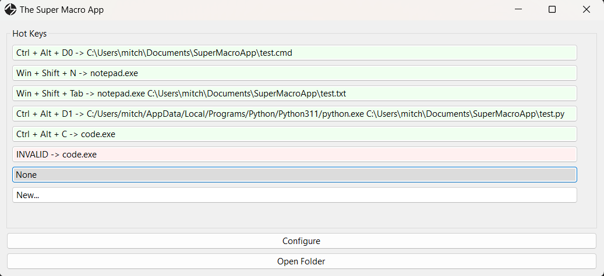
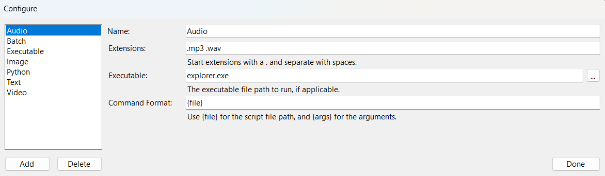

# The Super Macro App
A Windows application, meant to be able to create custom macros at the touch of a hot key.

## Installing
For the moment, installing is rather hands on. An installer will come in the future. For now, follow these steps:

* Navigate to the releases page on this Github repository.
* Download the most recent release.
* Unzip any files, if necessary.
* Run the program.

If you wish to have the program always start when you turn on your computer, please follow these steps:
* Press the windows button in the bottom left of the screen.
* Type "Run" and press enter.
* Enter "shell:startup" and press enter.
* In the file explorer window that appears, right click, go to new -> shortcut.
* Select the .exe for the Super Macro App application.

## Usage

### Guide
The Super Macro App lives in the System Tray. It can be accessed at any time by going to the system tray and clicking on it. It can also be forcibly closed by right clicking on it there, and hitting "Exit". It can also be accessed via the keyboard hot key: Ctrl + Alt + M.

Each macro must be associated with a script of some sort. The user can customize how each script is ran by clicking the Configure button. After doing so, a new script type can be added by pressing add. After doing so, information can be filled out for the type of script. Here are some working examples:
| Name | Extensions | Executable | Command Format |
| --- | --- | --- | --- |
| Batch | `.bat .cmd` | | {file} {args} |
| Python | `.py` | C:\Users\user\AppData\Local\Programs\Python\Python311\python.exe | {file} {args} |
| Text | `.txt` | explorer.exe | {file} |

To set the script for a macro, left click on the button to the right of the corresponding number key number you would like to set. Doing so will open a prompt, allowing you to select a file and enter some command line arguments (if applicable) for the macro app to run. After doing so, the button text will be updated with the name of the file and the arguments. To clear the macro, right click on the button. Here is an example:

After the macros have been set, press Ctrl + Alt + #, where # is the number key of the macro you would like to run. After doing so, the script will run in the background. As of right now, there is no way to see the input or output of the script.

### Hot Keys
| Combination | Action |
| --- | --- |
| Ctrl + Alt + M | Shows the Super Macro App. |
| Ctrl + Alt + [0-9] | Runs the macro of the given number key. |

## Todo/Possible Ideas

* [x] Create a way to dynamically add script types for users, and make it so the default application comes with some basics (Batch, Python, etc.)
* [x] Create better settings.
* [x] Create better system for command line arguments.
* [ ] Create a way to allow any key combination to be a shortcut, instead of just limiting to Ctrl + Alt + number key.
* [ ] Create a way to see the input and output of a script in the terminal, but only if necessary. Macro settings: always show terminal, never show, show if needed. Default to only show if needed.
* [ ] Limit the files that can be selected to only ones that have been configured, by default. Still have All Files as an option.